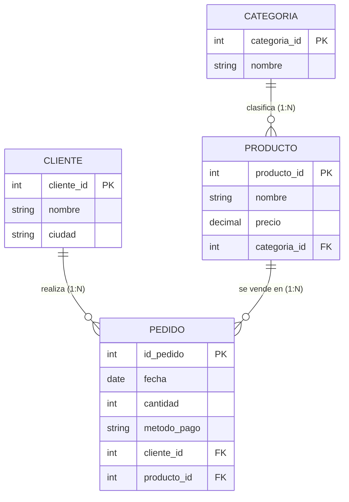

# ERD — Tienda de ventas

**Cardinalidades:** una categoría tiene muchos productos (1:N); un cliente realiza muchos pedidos (1:N); un producto aparece en muchos pedidos (1:N). Cada pedido pertenece a un solo cliente y a un solo producto.
